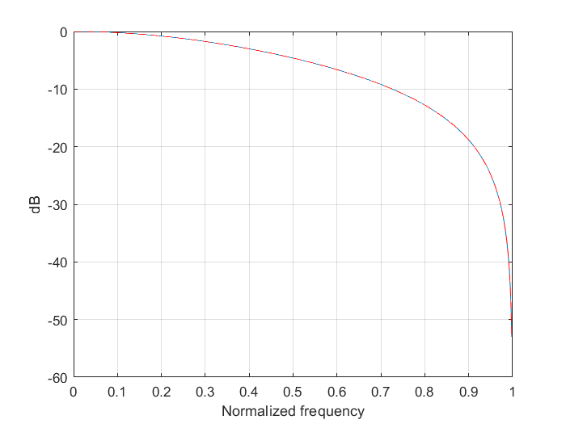
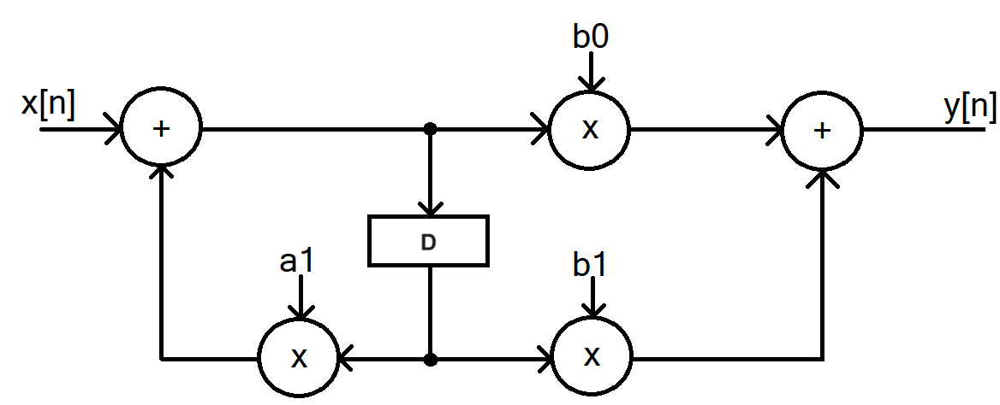
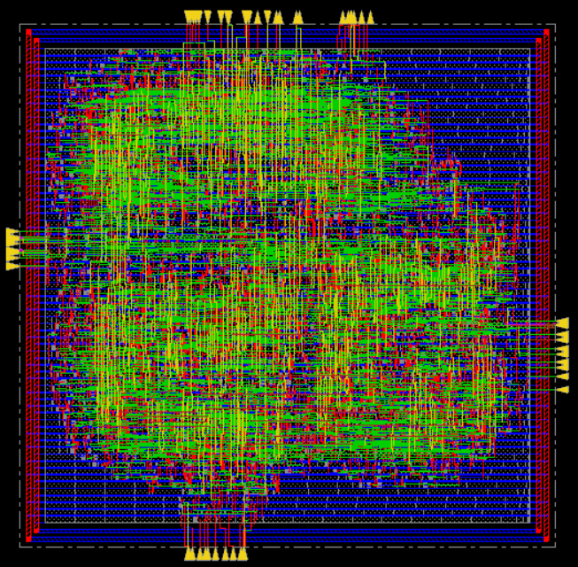
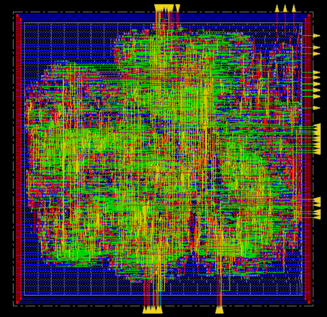

# IIR Digital Filter — VLSI Design & Implementation

> A complete ASIC design flow for a 1st-order IIR low-pass filter: from mathematical specification and fixed-point modeling through RTL, logic synthesis, clock gating, and place & route, implemented in two architectures, with the optimized design achieving **581 MHz** through J-look-ahead, pipelining, and retiming.


---

## Overview

This project implements and physically realizes a 1st-order Butterworth IIR low-pass filter following the complete VLSI design methodology:

**MATLAB** → **Fixed-Point C Model** → **VHDL RTL** → **Logic Synthesis (Synopsys DC)** → **Place & Route (Cadence Innovus)**

Two architectures are developed and compared end-to-end:

- **Standard Architecture** — Direct Form II implementation
- **Advanced Architecture** — J-look-ahead + pipelining + retiming for maximum throughput

The design targets the NanGate 45nm Open Cell Library and is verified bit-exactly against the fixed-point C reference model.

---

## Filter Specification

| Parameter             | Value                          |
|-----------------------|--------------------------------|
| Filter type           | IIR (Butterworth)              |
| Form                  | Direct Form II (canonical)     |
| Order                 | 1st order                      |
| Cut-off frequency     | 2 kHz                          |
| Sampling frequency    | 10 kHz                         |
| Data representation   | 2's complement fixed-point     |
| Bit width (nb)        | 14 bits (1 integer + 13 fractional) |
| Max THD requirement   | −30 dB                         |

**Filter coefficients** (Butterworth design via MATLAB `butter`, quantized to 14 bits):

| Coefficient | Floating Point | Integer (quantized) |
|-------------|---------------|---------------------|
| a₀          | 1.0000        | 8192                |
| a₁          | −0.1584       | −1298               |
| b₀          | 0.4208        | 3447                |
| b₁          | 0.4208        | 3447                |

### Frequency Response

The filter provides clean low-pass behavior with negligible quantization error and the floating-point (blue) and 14-bit fixed-point (red dashed) responses are nearly indistinguishable:



---

## Design Flow

### Stage 1 — MATLAB Reference Model

The filter is designed using MATLAB's `butter` function and the coefficients are quantized to `nb = 14` bits. A pseudo-fixed-point simulation applies the filter to a two-tone test signal (500 Hz in-band + 4500 Hz out-of-band) and evaluates THD:

- Floating-point THD: **−103.31 dB**
- Quantized THD: **−82.71 dB**

### Stage 2 — Fixed-Point C Model

A Direct Form II fixed-point C model is used to determine the minimum bitwidth reduction achievable while meeting the −30 dB THD requirement. After each multiplication, **21 bits are discarded** (right-shift by 21, then realign) to minimize hardware area.

- C model THD: **−30.557 dB** (meets ≤ −30 dB)

This C model becomes the golden reference and the VHDL output must be bit-exact with it at every subsequent stage.

### Stage 3 — VHDL RTL

The filter architecture is described in VHDL using parameterized register and logic-register components. All flip-flops carry an enable signal for clock gating. The design uses a hierarchical testbench with VHDL data generation/checking and a Verilog top-level wrapper.

**VHDL simulation THD: −30.557 dB**; bit-exact match with C model.

### Stage 4 — Logic Synthesis (Synopsys Design Compiler)

Synthesized against the NanGate 45nm library with timing-driven compilation. Both synthesis with and without clock gating are performed. Clock gating reduces dynamic power by ensuring registers only switch when new valid data arrives.

### Stage 5 — Place & Route (Cadence Innovus)

Physical implementation at f_clk = f_max / 2 with full CTS (Clock Tree Synthesis) and post-route optimization. Switching-activity-based power estimation is performed using VCD → SAIF annotation.

---

## Architectures

### Standard Architecture — Direct Form II

The 1st-order Direct Form II filter computes its state variable `sw[n]` with a single delay element shared between the feedback and feedforward paths, minimizing the number of registers:

```
sw[n] = x[n] − a₁ · sw[n−1]
y[n]  = b₀ · sw[n] + b₁ · sw[n−1]
```



All inputs, outputs, and intermediate values are registered. The coefficients (a₁, b₀, b₁) are supplied as external ports and registered on entry to support runtime reconfiguration.

### Advanced Architecture — J-Look-Ahead + Pipelining + Retiming

The standard architecture has a feedback loop with a critical path spanning one multiplication and one addition, limiting throughput. The advanced architecture breaks this bottleneck in three steps:

**Step 1 — J-Look-Ahead (J=1)**  
The filter equations are rewritten to express the current output in terms of delayed inputs, eliminating the tight feedback dependency. This introduces compound coefficients (e.g., `b₀·a₁`) and extra delay elements, but opens the DFG to pipelining.

```
sw[n−1] = x[n−1] − a₁ · sw[n−2]
y[n]    = b₀ · (x[n] − a₁(x[n−1] + a₁·sw[n−2])) + b₁ · (x[n−1] + a₁·sw[n−2])
```

**Step 2 — Pipelining**  
Two feedforward cutsets are identified in the expanded DFG and pipeline registers are inserted, splitting the long combinational paths.

**Step 3 — Retiming**  
Registers are repositioned across computational nodes to equalize path lengths and further shorten the critical path without changing the filter's transfer function.

The same coefficients are used — J-look-ahead is a pure architectural transformation that preserves the filter's input/output behavior.

---

## Results

### Performance Comparison

|                          | Standard Architecture | Advanced Architecture |
|--------------------------|-----------------------|-----------------------|
| Max clock frequency      | 395.25 MHz            | **581.40 MHz (+47%)** |
| Critical path delay      | 2.53 ns               | 1.72 ns               |
| Area (synthesis, no CG)  | 3414.11 µm²           | 4794.12 µm²           |
| Area (synthesis, w/ CG)  | 3026.55 µm²           | 4601.53 µm²           |
| CG area reduction        | −11.3%                | −4.0%                 |
| Post-P&R area            | 2986.10 µm²           | 4476.00 µm²           |
| Post-P&R gate count      | 3742                  | 5609                  |
| Post-P&R total power     | 0.517 mW              | 2.004 mW              |
| THD (all stages)         | −30.557 dB            | −30.557 dB            |
| Simulation cycles        | 390                   | 390                   |

The advanced architecture trades ~50% more area and ~4× higher power for a **47% increase in maximum clock frequency**, achieved through architectural optimization with no changes to the standard cell library or design constraints.

### Simulation Timing

| Architecture | Stage        | T_clk   | First VOUT | Last VOUT | Total Time |
|--------------|-------------|---------|------------|-----------|------------|
| Standard     | RTL         | 6.00 ns | 22 ns      | 2362 ns   | 2340 ns    |
| Standard     | Post-synth  | 2.53 ns | 10 ns      | 790 ns    | 780 ns     |
| Standard     | Post-P&R    | 5.54 ns | 22 ns      | 2362 ns   | 2340 ns    |
| Advanced     | RTL         | 6.00 ns | 30 ns      | 2370 ns   | 2360 ns    |
| Advanced     | Post-synth  | 1.72 ns | 10 ns      | 790 ns    | 780 ns     |
| Advanced     | Post-P&R    | 3.28 ns | 20 ns      | 1580 ns   | 1560 ns    |

### Physical Implementation

**Standard Architecture** — Post-P&R layout (Cadence Innovus, 45nm NanGate):



**Advanced Architecture** — Post-P&R layout after J-look-ahead + pipelining + retiming:



---

## Repository Structure

```
iir-filter-vlsi/
├── matlab/
│   ├── myiir_design.m          # Butterworth IIR design + 14-bit coefficient quantization
│   └── my_iir_filter.m         # Two-tone simulation, THD evaluation, file output
│
├── c_model/
│   ├── iir_filter_fixed_point.c  # Fixed-point Direct Form II model (reference for VHDL)
│   └── iir_filter_debug.c        # Verbose version printing all internal variables per sample
│
├── std_arch/                   # Standard Direct Form II architecture
│   ├── src/
│   │   ├── filter_param_pkg.vhd  # Parameter package (NB, N, SHAMT constants + components)
│   │   ├── reg.vhd               # Parameterized synchronous register with enable
│   │   ├── logic_reg.vhd         # Single-bit register with enable (for VIN/VOUT pipeline)
│   │   └── filter.vhd            # Top-level IIR filter architecture
│   ├── tb/
│   │   ├── clk_gen.vhd           # Clock and reset generator
│   │   ├── data_maker_new.vhd    # LFSR-driven stimulus generator (reads samples.txt)
│   │   ├── data_sink.vhd         # Output checker (writes results_HDL.txt)
│   │   └── tb.v                  # Verilog top-level testbench wrapper
│   └── syn/
│       └── synthesis.tcl         # Synopsys DC synthesis script
│
├── adv_arch/                   # Advanced architecture (J-look-ahead + pipeline + retiming)
│   ├── src/
│   │   ├── filter_param_pkg.vhd
│   │   ├── reg.vhd
│   │   ├── logic_reg.vhd
│   │   └── filter.vhd            # Advanced filter with pipeline and retiming registers
│   ├── tb/
│   │   └── (same testbench structure as std_arch/tb/)
│   └── syn/
│       └── synthesis.tcl         # Synopsys DC script (constrained to 1.72 ns)
│
└── docs/
    ├── dfg_standard.png          # Data flow graph — Direct Form II
    ├── freq_response.png         # MATLAB frequency response (float vs quantized)
    ├── time_domain_response.png  # MATLAB time-domain two-tone test
    ├── innovus_std.png           # Post-P&R layout, standard architecture
    └── innovus_adv.png           # Post-P&R layout, advanced architecture
```

---

## Interface

Both architectures share the same external interface:

```
CLK    : in  STD_LOGIC                    -- System clock
RST_n  : in  STD_LOGIC                    -- Active-low synchronous reset
VIN    : in  STD_LOGIC                    -- Input valid strobe
DIN    : in  SIGNED(13 downto 0)          -- Input sample (14-bit fixed-point)
Bi0    : in  SIGNED(13 downto 0)          -- Coefficient b₀
Bi     : in  SIGNED(13 downto 0)          -- Coefficient b₁
Ai     : in  SIGNED(13 downto 0)          -- Coefficient a₁
VOUT   : out STD_LOGIC                    -- Output valid strobe
DOUT   : out SIGNED(13 downto 0)          -- Output sample (14-bit fixed-point)
```

Data is represented as 2's complement normalized fixed-point: MSB weight = −2⁰, LSB weight = 2^(−nb+1). A new input sample is loaded on each rising edge where `VIN = '1'`; the corresponding output is valid one clock cycle later with `VOUT = '1'`. The design correctly holds state when `VIN` drops to `'0'` and resumes correctly when it returns to `'1'`.

---

## Tools & Environment

| Tool                    | Purpose                                       |
|-------------------------|-----------------------------------------------|
| MATLAB / Octave         | Filter design, coefficient quantization, THD  |
| GCC                     | Fixed-point C model compilation               |
| QuestaSim / ModelSim    | RTL and gate-level simulation                 |
| Synopsys Design Compiler| Logic synthesis, clock gating, power analysis |
| Cadence Innovus 20.11   | Place & Route, CTS, post-route optimization   |
| NanGate 45nm OCL        | Standard cell library                         |

---

## Running the Design

### 1. MATLAB Reference Model

```matlab
% In MATLAB, from the matlab/ directory:
myiir_design(1, 14)     % Design filter: order 1, 14 bits — plots frequency response
my_iir_filter           % Run two-tone simulation — generates samples.txt and resultsm.txt
```

### 2. Fixed-Point C Model

```bash
# From c_model/
gcc iir_filter_fixed_point.c -o iir_filter
./iir_filter ../matlab/samples.txt resultsC.txt

# For debug output (prints internal variables at each sample):
gcc iir_filter_debug.c -o iir_filter_debug
./iir_filter_debug ../matlab/samples.txt resultsC_debug.txt
```

### 3. RTL Simulation (QuestaSim)

Copy `samples.txt` into the simulation working directory, then compile and simulate the mixed VHDL/Verilog testbench:

```bash
# From std_arch/ (or adv_arch/)
vcom -work work src/filter_param_pkg.vhd
vcom -work work src/reg.vhd
vcom -work work src/logic_reg.vhd
vcom -work work src/filter.vhd
vcom -work work tb/clk_gen.vhd
vcom -work work tb/data_maker_new.vhd
vcom -work work tb/data_sink.vhd
vlog -work work tb/tb.v
vsim tb_iir
```

The testbench reads `samples.txt`, drives the filter, and writes `results_HDL.txt`. Compare against `resultsC.txt` using the MATLAB comparison script to verify bit-exact equivalence.

### 4. Logic Synthesis (Synopsys Design Compiler)

```bash
# From std_arch/syn/ (or adv_arch/syn/)
dc_shell -f synthesis.tcl
```

The script analyzes and elaborates the design, applies timing constraints, synthesizes with clock gating (`-gate_clock`), and exports the gate-level Verilog netlist, SDF, and SDC files to `netlist/`.

### 5. Place & Route (Cadence Innovus)

Import the clock-gated netlist and SDC into Cadence Innovus. The SDC clock period is set to **2× the synthesis critical path** (f_clk = f_max / 2). Follow the standard Innovus flow: floorplan → placement → pre-CTS optimization → CTS → post-CTS optimization → routing → post-route optimization → sign-off.

---

## Design Decisions

**Why Direct Form II?**  
Direct Form II minimizes the number of delay elements (registers) by sharing the state variable between the feedforward and feedback paths, making it the most hardware-efficient structure for a 1st-order IIR filter.

**Why 21 bits discarded after multiplication?**  
Each multiplication of two 14-bit values produces a 28-bit result. The 21-bit right-shift discards the least significant bits, reducing the result to 14 bits while keeping the integer part intact. This was the minimum shift amount that still met the −30 dB THD requirement and fewer bits discarded would have required wider adders and more silicon area.

**Why does J-look-ahead not change the coefficients here?**  
For this specific 1st-order filter with J=1, the look-ahead transformation is a pure rewriting of the difference equations. The composite coefficients that would normally differ from the originals happen to collapse back to the same values, so the same quantized coefficients drive both architectures.

---

## Academic Context

Developed as part of the **Integrated Systems Architectures** course at **Politecnico di Torino** (MSc Electronic Engineering — Embedded Systems), 2023–2024, and the complete design flow from mathematical specification to a fully placed-and-routed chip layout was implemented and verified.
